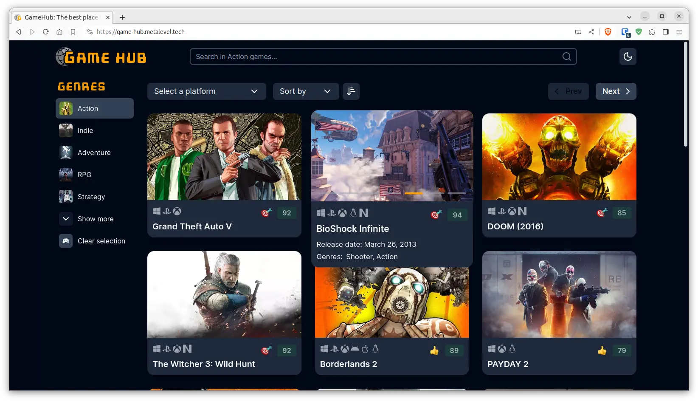

# Game hub

This is a simplified replica of the [RAWG's site](https://rawg.io/), which uses the non-commercial access of their [API](https://rawg.io/apidocs).

[](https://game-hub.metalevel.tech/)

The project is based on the Mosh Hamedani's course [React 18 and TypeScript](https://codewithmosh.com/p/ultimate-react-part1) but with a couple of improvements. For example: This is a Next.js 13.6 implementation, also instead of [Bootstrap](https://getbootstrap.com/) and [Chakra UI](https://chakra-ui.com/) are used [Tailwind CSS](https://tailwindcss.com/) and [Shadcn/UI](https://ui.shadcn.com/), and more.

## References and credits

- [React 18 and TypeScript: Code with Mosh Course](https://codewithmosh.com/p/ultimate-react-part1)
- [Mosh at GitHub: **The Ultimate React Course - Part 1**](https://github.com/mosh-hamedani/react-course-part1)
- [Mosh at GitHub: **GameHub**](https://github.com/mosh-hamedani/game-hub)
- [RAWG API Docs](https://rawg.io/apidocs) | [RAWG Home](https://rawg.io/)

This is a [Next.js](https://nextjs.org/) project bootstrapped with [`create-next-app`](https://github.com/vercel/next.js/tree/canary/packages/create-next-app) and hosted on [Vercel](https://vercel.com/).

Because the application exhaust too quickly the  the image optimization quota of Vercel the optimization on production is disabled.

## Final touches (to do)

- [x] Fancy game card hover behavior, like RAWG.
- [x] When the Next.js' image optimization is disabled: Proxy the RAWG Media files to avoid issues related to CORS and private networks with restrictions. In addition cache them for better application performance.
- [x] Improve the behaviour of the "color theme selector".
- [x] Clear all filters and show all games, when click on the logo. A little bit ugly solution which uses `<a href="/">` is applied.
- [x] Create game-images gallery.
- [x] Scroll to top button. Fix the known issue of the mobile browsers 100vh bug, see: [`globals.css`](app/globals.css#L14) and [`Games_Navigation_Float.tsx`](components/Games_Navigation_Float.tsx#L26)

## Getting Started Dev

Install the dependencies:

```bash
npm install
```

Checkout the [`.env.example`](.env.example) file and create a `.env.local` file with an actual value of `RAWG_API_KEY`.

In addition you may want to create a Vercel project and link it to the repository then you can manage the environment variables from the Vercel admin panel.

Run the development server:

```bash
npm run dev
```

Open [http://localhost:3001](http://localhost:3001) with your browser to see the result.
